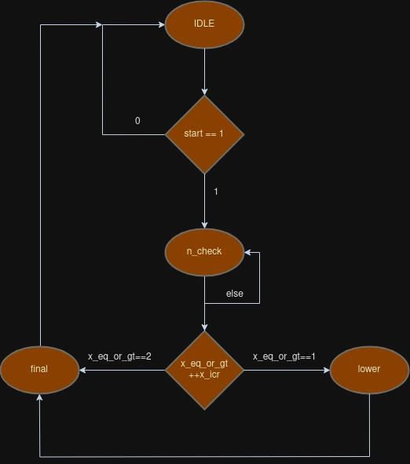

# MSREAL-Square-Root-
Razviti Linux drajver i odgovarajuću aplikaciju koja koristi drajver i demonstrira kontrolu i upravljanje sqrt IP jezgrom.
## Intro
- [MSREAL-Square-Root-](#msreal-square-root-)
  - [Intro](#intro)
  - [Detaljan opis projekta](#detaljan-opis-projekta)
    - [Tekst zadatka projekta](#tekst-zadatka-projekta)
    - [Opis strukture hardvera](#opis-strukture-hardvera)
    - [Registar Ofseti](#registar-ofseti)
    - [Koraci](#koraci)
    - [Primer korišćenja drajvera](#primer-korišćenja-drajvera)
  - [Opis algoritma](#opis-algoritma)
  - [ASM dijagram](#asm-dijagram)
  - [RTL Model](#rtl-model)
  - [Izlazni signali](#izlazni-signali)
  - [Licenca](#licenca)
  - [Kontakt](#kontakt)

## Detaljan opis projekta
    
### Tekst zadatka projekta
Razviti Linux drajver i odgovarajuću aplikaciju koja koristi drajver i demonstrira kontrolu i upravljanje sqrt IP jezgrom.
    
### Opis strukture hardvera
Četiri identična sqrt IP jezgra (zelena boja na blok dijagramu) su memorijski mapirana u adresni prostor ZYNQ procesora. Sqrt jezgro služi za računanje celobrojnog kvadratnog korena. IP jezgro koristi brute-force algoritam, pri čemu jezgru treba “n” mašinskih ciklusa za računanje kvadratnog korena broja “n” [vreme izvršavanja je linearno O(n)]. Sva jezgra na fpga čipu rade na frekvenciji od 100MHz. Nakon što sqrt ip jezgro izračuna kvadratni koren, ono šalje interrupt prekidni signal procesoru (ljubičasta boja na blok dijagramu), čime signalizira da je obrada podatka završena.
    
Sqrt jezgro ima četiri registra: `X`, `start`, `Y` i `ready` koja su memorijski mapirana i kojima se pristupa uz baznu adresu sqrt modula i ofseta za određeni registar (videti ofsete registara u datoj tabeli).

### Registar Ofseti
| Offset          | Registar         |
|-----------------|------------------|
| 0               | X                |        
| 4               | start            |
| 8               | Y                |
| 12              | ready            |
| 16              | interrupt_flag   |

- **X registar:** Smešta 32-bitni broj čiji se koren traži.
- **Start registar:** Služi za pokretanje jezgra i početak računanja korena.
- **Y registar:** Po završetku računanja, smešta rezultat, tj. kvadratni koren broja `X`.
- **Ready registar:** Indikuje da li je sqrt završio sa računanjem.

### Koraci
1. **Priprema SD kartice:**
    - Pripremiti SD karticu sa svim potrebnim datotekama (`BOOT.bin`, `devicetree.dtb` i `uImage`) koje omogućavaju podizanje Linux operativnog sistema, sa gore opisanim dizajnom uključenim u `BOOT.bin` datoteku.
2. **Linux drajver:**
    - Napisati Linux drajver za sqrt modul i propratnu aplikaciju sa sledećim funkcionalnostima:
        - Drajver dobija slobodne upravljačke brojeve (MAJOR, MINOR) od operativnog sistema.
        - Automatski kreira node fajl `/dev/sqrt`.
        - Kontroliše četiri sqrt modula i gpio modul koji se koristi za kontrolu dioda.
3. **Aplikacija:**
    - Aplikacija u C jeziku koja stres-testira drajver tako što u nasumičnim intervalima od 1-5 sekundi šalje nizove nasumične dužine (4-8 članova) nasumičnih brojeva (koji imaju celobrojne kvadrate, te su u dozvoljenom opsegu). Takođe, aplikacija u nasumičnim intervalima od 3-5 sekundi čita do tog trenutka izračunate brojeve i proverava dobijene rezultate (parove x:y).

### Primer korišćenja drajvera
```bash
echo “16,255,9,10000,176400,16000000,25,1073741824” > /dev/sqrt
```
```bash
cat /dev/sqrt
```
Očekivani izlaz: 16:4, 255:25, 9:3, 10000:100, 176400:420, 16000000:4000, 25:5, 1073741824:32768

## Opis algoritma


Brute-force algoritam za traženje kvadratnog korena celog broja je jednostavan, ali neefikasan metod koji koristi iterativni pristup za pronalaženje najvećeg celog broja čiji kvadrat nije veći od datog broja. Ovaj algoritam je jednostavan za implementaciju, ali može biti vrlo spor za velike brojeve zbog svoje linearne složenosti.
Kako funkcioniše brute-force algoritam za traženje kvadratnog korena

- Inicijalizacija: Počinjemo sa kandidatom za kvadratni koren, obično od 0 
  
- Iteracija: Povećavamo kandidata za 1 u svakoj iteraciji i proveravamo da li je kvadrat kandidata manji ili jednak datom broju 
  
- Zaustavljanje: Kada kvadrat kandidata postane veći od datog broja, zaustavljamo iteraciju. Prethodni kandidat je najveći ceo broj čiji kvadrat nije veći od datog broja.

Implementacija u C -u :

```c
#include <stdio.h>

int brute_force_sqrt(int n)
{
    if (n < 0)
    {
        return -1;  // Kvadratni koren negativnog broja nije definisan u realnom domenu
    }

    int candidate = 0;
    while (candidate * candidate <= n)
    {
        ++candidate;
    }

    return candidate - 1;
}

int main()
{

    int arr[] = {16 , 15 , 0 , -32 , 1073741824 , 99 , 225 , 2 , 70707 };
    int array_size = sizeof(arr) / sizeof(arr[0]);

    for (int i = 0; i < array_size; ++i)
    {
        int result = brute_force_sqrt(arr[i]);
        printf("Kvadratni koren broja %d je %d\n", arr[i], result);
    }
}

```

Output : 
```
Kvadratni koren broja 16 je 4
Kvadratni koren broja 15 je 3
Kvadratni koren broja 0 je 0
Kvadratni koren broja -32 je -1
Kvadratni koren broja 1073741824 je 32768
Kvadratni koren broja 99 je 9
Kvadratni koren broja 225 je 15
Kvadratni koren broja 2 je 1
Kvadratni koren broja 70707 je 265
```

Analiza složenosti : 

- Vremenska složenost: O(n), gde je n vrednost ulaznog broja. U najgorem slučaju, algoritam će izvršiti n iteracija.

- Prostorna složenost: O(1), jer algoritam koristi konstantnu količinu dodatne memorije.

Prednosti i nedostaci : 
- Prednosti:

    Jednostavan za implementaciju i razumevanje.
    Ne zahteva dodatnu memoriju osim nekoliko promenljivih.

- Nedostaci:

    Veoma neefikasan za velike brojeve zbog linearne vremenske složenosti.
    
Note : Postoje mnogo efikasniji algoritmi za traženje kvadratnog korena, kao što su Newton-Raphson metoda ili binarna pretraga.Primeri koda za ova dva algoritma su takodje postavljeni.

## ASM dijagram


ASM dijagram prikazuje tok stanja za kontrolni put (FSM) kvadratnog korena projekta. FSM ima četiri osnovna stanja: 
1. IDLE

    Inicijalno stanje FSM-a.
    FSM ostaje u ovom stanju dok signal start ne postane '1'.

    Kada start postane '1', FSM prelazi u stanje n_check.
2. N_CHECK

    Proverava vrednost ulaznog signala x_eq_or_gt.
    
    Ako je x_eq_or_gt = "10", prelazi u stanje final.
    
    Ako je x_eq_or_gt = "01", prelazi u stanje lower.

    Ako nijedan od prethodnih uslova nije ispunjen, povećava vrednost x_incr i ostaje u ovom stanju.

3. LOWER 

    Ovim stanjem se upravlja kada je kvadrat trenutne vrednosti manji od ulaznog broja.

    Prelazi u stanje final.

4. FINAL

    Završno stanje.

    FSM prelazi nazad u stanje idle nakon završetka računanja.

Dijagram stanja : 




## RTL Model 


1. Struktura Sistema

    Procesorski sistem (ZYNQ Processing System):
    - PS7_0: Ovaj blok predstavlja procesorski sistem baziran na ARM arhitekturi koji je integrisan sa FPGA logikom. On obavlja glavne proračune i upravlja komunikacijom sa ostalim delovima sistema.
  
    - M_AXI_GP0: Glavni AXI interfejs koji omogućava komunikaciju između procesorskog sistema i perifernih modula.

2. AXI Interfejs

    AXI Interconnect:
     - Ovaj blok upravlja komunikacijom između procesorskog sistema i različitih perifernih modula preko AXI protokola.
    Uključuje multipleksiranje i demultipleksiranje signala ka i od različitih periferija.

3. SQRT IP Jezgra

    sqrt_IP_v1_0_0, sqrt_IP_v1_0_1, sqrt_IP_v1_0_2, sqrt_IP_v1_0_3:
    - Četiri identična IP jezgra za računanje kvadratnog korena. Svako jezgro je memorijski mapirano u adresni prostor ZYNQ procesora.
    Ova jezgra koriste brute-force algoritam za računanje celobrojnog kvadratnog korena.
    
    - Svako jezgro ima 4 registra:
      1.  "X" (ulazni broj), 
      2.  "start" (pokretanje računanja), 
      3.  "Y" (izlazni rezultat), 
      4.  "ready" (statusni registar).

4. GPIO Modul

    axi_gpio_0, axi_gpio_1, axi_gpio_2:
    - Ovi moduli omogućavaju kontrolu i upravljanje LED diodama koje signaliziraju status svake od sqrt jezgara.
    Svaki GPIO modul je povezan sa specifičnim LED diodama kako bi se moglo pratiti koje jezgro trenutno obavlja proračun.

5. Reset i Tajmer Moduli

    axi_timer_0:
    - Tajmer modul koji može generisati prekide i upravljati vremenskim događajima u sistemu.
    
    rst_ps7_0_100M:

    - Reset modul koji upravlja reset signalima za različite delove sistema kako bi se osigurao ispravan start i rad sistema.

Funkcionalnost Sistema

 - Memorijski mapirana sqrt jezgra:
   Svako sqrt jezgro koristi brute-force metod za računanje celobrojnog kvadratnog korena. Jezgra rade paralelno, što omogućava brže izračunavanje kada se obradi veći broj brojeva.
 - Kontrola LED dioda:
   LED diode se pale kada je određeno sqrt jezgro aktivno, omogućavajući vizuelni prikaz rada sistema.
 - AXI interfejs za komunikaciju:
   AXI interfejs omogućava efikasnu komunikaciju između procesorskog sistema i perifernih modula.
    
## Izlazni signali

Na sledećim slikama su prikazani signali i stanja kada su zadati brojevi 16 i 15 , ovo brojevi su uzeti nasumično.
Stanje mašine prelazi kroz različita stanja kako bi izračunala kvadratni koren datih celih brojeva. Testbenčevi potvrđuju funkcionalnost dizajna, uključujući slučajeve kada rezultat izračunavanja kvadratnog korena rezultira prelivanjem.

Kratak opis signala : 

 - reset_tb: Resetuje stanje mašine na početno stanje.
 - ready_tb: Indikuje da je stanje mašine spremno za novu operaciju.
 - clk_tb: Signal sata za sinhronizaciju stanja mašine.
 - start_tb: Inicira izračunavanje kvadratnog korena.
 - x_in_tb[31:0]: Ulazni ceo broj za koji se izračunava kvadratni koren.
 - curr_state[2:0]: Trenutno stanje mašine.
 - result_out_tb[31:0]: Izlazni rezultat izračunavanja kvadratnog korena.

Rezultati Testbenča :

  Regularni Slučaj (Kvadratni koren od 16)
  Ovaj test slučaj izračunava kvadratni koren od 16. 
  Prelazi stanja koje se posmatraju su idle -> n_check -> final -> idle (0 -> 1 -> 3 -> 0).
  U svakom koraku kada je kvadrat pretpostavljenog broja manji od zadatog ulaznog broja , ostaje se u stanju n_check i brojač se uveća za 1.
  Nakon 5 koraka dobija se da je pretpostavljeni broj 4 i njegov kvadrat je jednak ulaznom broju 16. 
  Odlazi se u stanje final i nakon toga u stanje idle.

Vremenski dijagram :
        


## Licenca 

Projekat je obljavljen pod MIT licencom , za više detalja pročitati https://opensource.org/license/MIT 

## Kontakt 

Za sva pitanja , nejasnoće , nedoumice , sugestije pišite mi na : petnenadd_d@uns.ac.rs .
